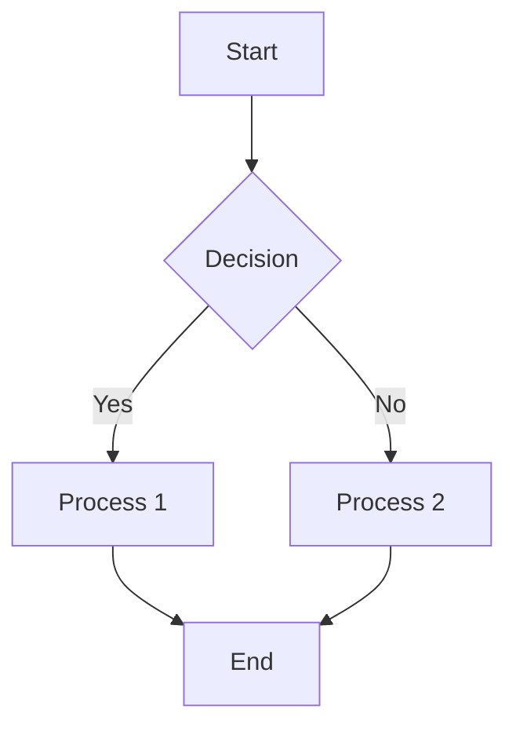
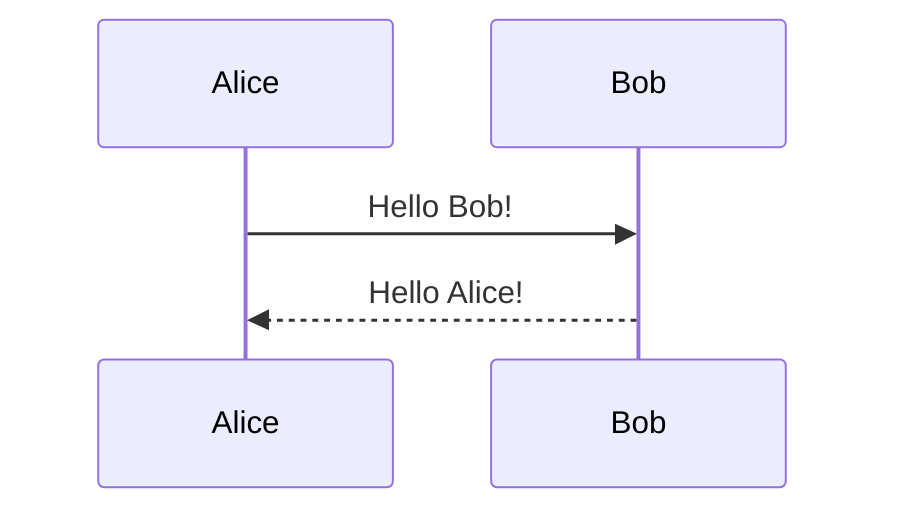
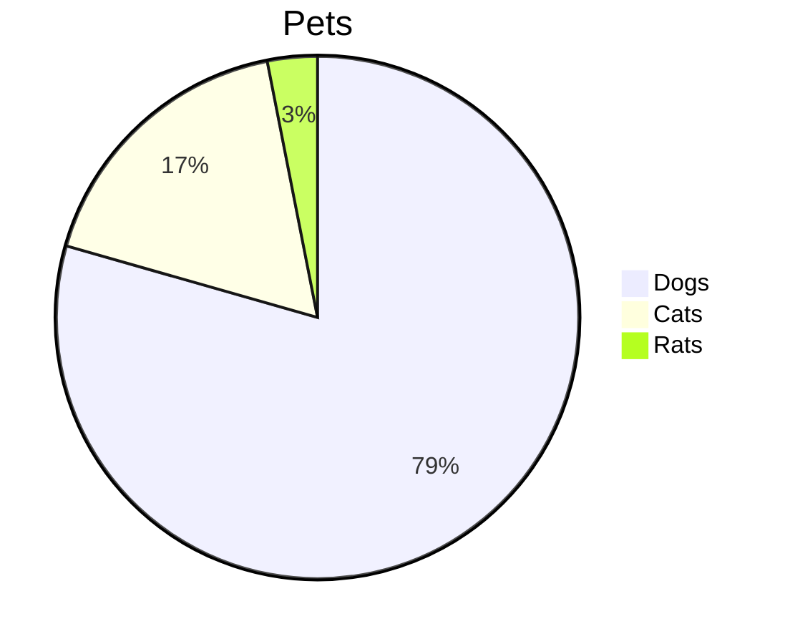

# 📖 Hướng dẫn Markdown đầy đủ

Markdown là ngôn ngữ đánh dấu nhẹ giúp định dạng văn bản một cách đơn giản và hiệu quả.

## 📋 Mục lục

- [Cú pháp cơ bản](#cú-pháp-cơ-bản)
- [Tiêu đề](#tiêu-đề)
- [Định dạng text](#định-dạng-text)
- [Danh sách](#danh-sách)
- [Links và Images](#links-và-images)
- [Code và Syntax Highlighting](#code-và-syntax-highlighting)
- [Bảng](#bảng)
- [Blockquotes](#blockquotes)
- [Đường kẻ ngang](#đường-kẻ-ngang)
- [HTML trong Markdown](#html-trong-markdown)
- [Escape Characters](#escape-characters)
- [Mermaid Diagrams](#mermaid-diagrams)
- [GitHub Flavored Markdown](#github-flavored-markdown)
- [Tips và Tricks](#tips-và-tricks)

---

## 🔤 Cú pháp cơ bản

### Tiêu đề

```markdown
# Heading 1
## Heading 2
### Heading 3
#### Heading 4
##### Heading 5
###### Heading 6

Cách khác cho Heading 1
=====================

Cách khác cho Heading 2
---------------------
```

**Kết quả:**
# Heading 1
## Heading 2
### Heading 3
#### Heading 4
##### Heading 5
###### Heading 6

---

## ✨ Định dạng text

### Text cơ bản

```markdown
**Bold text** hoặc __Bold text__
*Italic text* hoặc _Italic text_
***Bold và Italic*** hoặc ___Bold và Italic___
~~Strikethrough~~
`Inline code`
Text thường

Xuống dòng cần 2 spaces ở cuối dòng  
hoặc để trống 1 dòng

Đây là đoạn văn mới.
```

**Kết quả:**
**Bold text** hoặc __Bold text__
*Italic text* hoặc _Italic text_
***Bold và Italic*** hoặc ___Bold và Italic___
~~Strikethrough~~
`Inline code`
Text thường

### Subscript và Superscript

```markdown
H<sub>2</sub>O
X<sup>2</sup> + Y<sup>2</sup> = Z<sup>2</sup>
```

**Kết quả:**
H<sub>2</sub>O
X<sup>2</sup> + Y<sup>2</sup> = Z<sup>2</sup>

### Highlight text

```markdown
==Highlighted text== (không hỗ trợ trên tất cả platforms)
<mark>Highlighted text</mark> (sử dụng HTML)
```

**Kết quả:**
<mark>Highlighted text</mark>

---

## 📝 Danh sách

### Danh sách không có thứ tự

```markdown
- Item 1
- Item 2
  - Sub item 2.1
  - Sub item 2.2
    - Sub sub item 2.2.1
- Item 3

* Cũng có thể dùng dấu *
+ Hoặc dấu +
```

**Kết quả:**
- Item 1
- Item 2
  - Sub item 2.1
  - Sub item 2.2
    - Sub sub item 2.2.1
- Item 3

### Danh sách có thứ tự

```markdown
1. First item
2. Second item
   1. Sub item 2.1
   2. Sub item 2.2
3. Third item

1. Có thể dùng cùng số
1. Markdown sẽ tự động đánh số
1. Cho các item
```

**Kết quả:**
1. First item
2. Second item
   1. Sub item 2.1
   2. Sub item 2.2
3. Third item

### Task Lists (GitHub)

```markdown
- [x] Completed task
- [ ] Incomplete task
- [x] Another completed task
  - [ ] Sub task
  - [x] Completed sub task
```

**Kết quả:**
- [x] Completed task
- [ ] Incomplete task
- [x] Another completed task
  - [ ] Sub task
  - [x] Completed sub task

---

## 🔗 Links và Images

### Links

```markdown
[Link text](https://example.com)
[Link với title](https://example.com "Tooltip text")
<https://example.com>
[Link tham chiếu][1]

[1]: https://example.com "Link reference"

[Link nội bộ](#tiêu-đề)
[Link tới file](./path/to/file.md)
```

### Images

```markdown


<!-- Image với link -->
[](https://example.com)

<!-- HTML cho kiểm soát size -->


<!-- Image reference -->
![Alt text][image-ref]
[image-ref]: https://via.placeholder.com/300x200
```

### Cách chèn hình ảnh từ các nguồn khác nhau

```markdown
<!-- Từ URL trực tiếp -->


<!-- Từ thư mục local -->


<!-- Từ GitHub -->


<!-- Từ issue/PR GitHub -->


<!-- Base64 embedded (không khuyến khích) -->

```

---

## 💻 Code và Syntax Highlighting

### Inline code

```markdown
Sử dụng `console.log()` để debug.
Có thể escape với \`backticks\`.
```

### Code blocks

````markdown
```
Code block không syntax highlighting
```

```javascript
// JavaScript code
function hello(name) {
    console.log(`Hello, ${name}!`);
}

hello("World");
```

```python
# Python code
def hello(name):
    print(f"Hello, {name}!")

hello("World")
```

```bash
# Bash commands
npm install
git commit -m "Update README"
```

```json
{
    "name": "example",
    "version": "1.0.0",
    "description": "Example package"
}
```

```css
/* CSS */
.container {
    display: flex;
    justify-content: center;
    align-items: center;
}
```

```sql
-- SQL
SELECT * FROM users 
WHERE age > 18 
ORDER BY created_at DESC;
```
````

### Diff highlighting

````markdown
```diff
- Removed line
+ Added line
  Unchanged line
```
````

---

## 📊 Bảng

### Bảng cơ bản

```markdown
| Header 1 | Header 2 | Header 3 |
|----------|----------|----------|
| Row 1    | Data     | More data|
| Row 2    | Data     | More data|
```

### Bảng với căn chỉnh

```markdown
| Left align | Center align | Right align |
|:-----------|:------------:|------------:|
| Left       |    Center    |       Right |
| Text       |    Text      |        Text |
```

**Kết quả:**
| Left align | Center align | Right align |
|:-----------|:------------:|------------:|
| Left       |    Center    |       Right |
| Text       |    Text      |        Text |

### Bảng phức tạp

```markdown
| Feature | Free | Premium | Enterprise |
|---------|:----:|:-------:|:----------:|
| Storage | 5GB  |  100GB  |  Unlimited |
| Users   |  1   |   10    |  Unlimited |
| Support | ❌   |   ✅    |     ✅     |
| Price   | $0   |  $10    |   Custom   |
```

---

## 💬 Blockquotes

```markdown
> Đây là blockquote đơn giản.

> Blockquote có thể
> span nhiều dòng.

> Blockquote level 1
>> Blockquote level 2
>>> Blockquote level 3

> **Note**: Có thể sử dụng formatting trong blockquote.
> 
> - Danh sách
> - Code: `example`
```

**Kết quả:**
> Đây là blockquote đơn giản.

> **Note**: Có thể sử dụng formatting trong blockquote.
> 
> - Danh sách
> - Code: `example`

---

## ➖ Đường kẻ ngang

```markdown
---
***
___

Hoặc nhiều hơn:
-----
*****
```

---

## 🌐 HTML trong Markdown

```markdown
<div align="center">
    <h2>Centered HTML heading</h2>
    <p>HTML paragraph</p>
</div>

<details>
<summary>Click để mở rộng</summary>

Nội dung ẩn trong details.

</details>

<kbd>Ctrl</kbd> + <kbd>C</kbd>

<abbr title="HyperText Markup Language">HTML</abbr>
```

**Kết quả:**
<details>
<summary>Click để mở rộng</summary>

Nội dung ẩn trong details.

</details>

<kbd>Ctrl</kbd> + <kbd>C</kbd>

---

## 🔧 Escape Characters

```markdown
\*Không italic\*
\`Không code\`
\# Không heading
\[Không link\](example.com)
\\Backslash thực

Các ký tự cần escape: \ ` * _ { } [ ] ( ) # + - . !
```

---

## 📈 Mermaid Diagrams

````markdown






```mermaid
gitgraph
    commit
    commit
    branch develop
    checkout develop
    commit
    commit
    checkout main
    merge develop
```
````

---

## 🐙 GitHub Flavored Markdown

### Mentions và References

```markdown
@username - mention user
#123 - link to issue/PR
user/repo#123 - cross-repo reference
SHA: 16c999e8c71134401a78d4d46435517b2271d6ac
user@16c999e - commit reference
```

### Emojis

```markdown
:smile: :heart: :thumbsup: :rocket: :fire:
:warning: :x: :heavy_check_mark: :bulb: :zap:

GitHub shortcuts:
:+1: :-1: :shipit: :octocat:
```

**Kết quả:**
😄 ❤️ 👍 🚀 🔥
⚠️ ❌ ✅ 💡 ⚡

### Alerts (GitHub)

```markdown
> [!NOTE]
> Useful information that users should know.

> [!TIP]
> Helpful advice for doing things better.

> [!IMPORTANT]
> Key information users need to know.

> [!WARNING]
> Critical content demanding user attention.

> [!CAUTION]
> Negative potential consequences of an action.
```

---

## 🎯 Tips và Tricks

### 1. Tổ chức nội dung

```markdown
<!-- Comments không hiển thị -->

<!-- Table of Contents tự động -->
- [Section 1](#section-1)
- [Section 2](#section-2)

<!-- Anchor links -->
<a name="custom-anchor"></a>
## Section với custom anchor

[Link tới anchor](#custom-anchor)
```

### 2. Shields/Badges

```markdown


```

### 3. Formatting tricks

```markdown
<!-- Line break -->
Text line 1<br>
Text line 2

<!-- Non-breaking space -->
Word&nbsp;không&nbsp;bị&nbsp;ngắt&nbsp;dòng

<!-- Center align -->
<div align="center">Centered content</div>

<!-- Right align -->
<div align="right">Right aligned</div>
```

### 4. Advanced tables

```markdown
<!-- Table với HTML -->
<table>
<tr>
<td>

**Markdown trong cell**

- List item 1
- List item 2

</td>
<td>

```javascript
console.log("Code trong cell");
```

</td>
</tr>
</table>
```

### 5. Footnotes

```markdown
Đây là text với footnote[^1].

Footnote khác[^note].

[^1]: Đây là footnote đầu tiên.
[^note]: Footnote có thể có tên.
```

### 6. Definition Lists

```markdown
Term 1
:   Definition 1

Term 2
:   Definition 2a
:   Definition 2b
```

### 7. Mathematical expressions

```markdown
Inline math: $x = y^2$

Block math:
$$
\sum_{i=1}^{n} x_i = x_1 + x_2 + \cdots + x_n
$$
```

---

## 🔄 Workflow tips

### README structure

```markdown
# Project Title

Brief description

## Table of Contents
## Installation
## Usage
## API Reference
## Contributing
## License
## Contact
```

### Documentation structure

```markdown
# docs/
├── README.md          # Overview
├── installation.md    # Setup guide
├── usage.md          # How to use
├── api.md            # API docs
├── examples/         # Code examples
└── troubleshooting.md # Common issues
```

### Best practices

1. **Consistent formatting**: Dùng cùng style cho toàn bộ document
2. **Clear headings**: Sử dụng hierarchy rõ ràng
3. **Code examples**: Luôn có ví dụ thực tế
4. **Links**: Test tất cả links trước khi publish
5. **Images**: Optimize size và dùng alt text
6. **Table of contents**: Cho documents dài
7. **Version control**: Track changes trong CHANGELOG.md

---

## 🛠️ Tools hỗ trợ

### Online editors
- **Typora**: WYSIWYG editor
- **Mark Text**: Real-time preview
- **Dillinger**: Online editor
- **StackEdit**: Browser-based

### VS Code extensions
- **Markdown All in One**: Complete toolset
- **Markdown Preview Enhanced**: Advanced preview
- **Markdown Lint**: Style checking
- **Auto-Open Markdown Preview**: Auto preview

### Command line tools
```bash
# Convert markdown
pandoc input.md -o output.pdf
pandoc input.md -o output.html

# Lint markdown
markdownlint *.md

# Live preview
grip README.md
```

---

## 📚 Tài liệu tham khảo

- [CommonMark Spec](https://commonmark.org/)
- [GitHub Flavored Markdown](https://github.github.com/gfm/)
- [Markdown Guide](https://www.markdownguide.org/)
- [Awesome Markdown](https://github.com/mundimark/awesome-markdown)

---

*Hướng dẫn này covers hầu hết tính năng của Markdown. Practice makes perfect! 🚀*